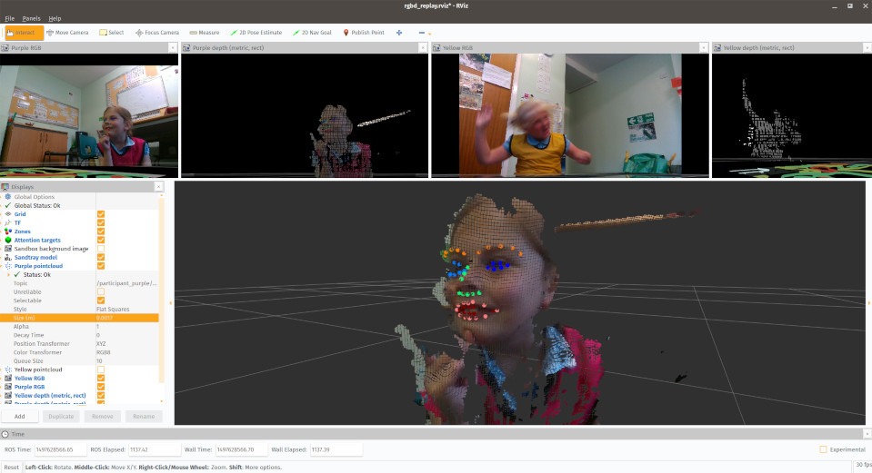

gazr
====


*gazr* is a library and a set of tools for real-time face tracking and gaze
estimation from a monocular camera (typically, a webcam) or a RGB-D stream (3D
camera).

It natively supports [ROS](http://ros.org).

Currently, it only performs 6D head pose estimation. Eye orientation based on
pupil tracking is being worked on.

If you plan to use this library for academic purposes, we kindly request you to
[cite our work](CITATION).

Head pose estimation
--------------------


This library (`libhead_pose_estimation.so`) performs 3D head pose estimation
based on the fantastic [dlib](http://dlib.net/) face detector and a bit of
[OpenCV's
solvePnP](http://docs.opencv.org/modules/calib3d/doc/camera_calibration_and_3d_reconstruction.html#solvepnp) magic (it uses [adult male anthropometric](https://github.com/chili-epfl/attention-tracker/blob/5dcef870c96892d80ca17959528efba0b2d0ce1c/src/head_pose_estimation.hpp#L12) data to match a real 3D head to the projected image).

The library returns a 4x4 transformation matrix.

It supports detection and tracking of multiple faces at the same time, and runs
on-line, but it *does not* provide face identification/recognition.

3D facial features extraction
-----------------------------



If provided with an RGB-D (color + depth) stream, the library can extract and
compute the 3D localisation of 68 facial landmarks (cf screenshot above).

*Note that this feature is currently only available for ROS.*


Installation
------------

**Note**: The library has only been tested on Linux. We can only provide limited
support for other operating systems!

### Pre-requisites

You need to [download](http://dlib.net/) and extract ``Dlib`` somewhere. This
application requires ``dlib >= 18.18``. On Ubuntu 16.04 and above, `sudo
apt-get install libdlib-dev`

You also need OpenCV. On Ubuntu, `sudo apt-get install libopencv-dev`.

### Installation - 1/2

The library uses a standard ``CMake`` workflow:

```
$ mkdir build && cd build
$ cmake ..
$ make
```

#### Example - show head pose

Run ``./gazr_show_head_pose ../share/shape_predictor_68_face_landmarks.dat`` to test
the library. You should get something very similar to the picture above.

#### Example - estimate head pose on image/images

Run ``./gazr_estimate_head_pose ../share/shape_predictor_68_face_landmarks.dat frame.jpg``
to print the head pose detected in _frame.jpg_.

Run ``./gazr_estimate_head_pose ../share/shape_predictor_68_face_landmarks.dat image_file_names.txt``
to print the head pose detected in each image file listed in _image\_file\_names.txt_ (image file names written in new lines).


### Installation - 2/2

Finally, to install the library:

```
$ make install
```

ROS support
-----------

### Installation

The [ROS](http://www.ros.org/) wrapper provides a convenient node that exposes
each detected face as a TF frame.

Before building gazr with the ROS wrapper, make sure that you have installed the
 following ROS- < distro > package dependencies, where
< distro > is the ROS distribution in your machine.
For example, this is the case for ROS-kinetic distribution:
```
sudo apt-get install ros-kinetic-roscpp ros-kinetic-tf ros-kinetic-std-msgs ros-kinetic-visualization-msgs ros-kinetic-sensor-msgs ros-kinetic-cv-bridge ros-kinetic-image-transport ros-kinetic-image-geometry
```

Enable the compilation of the ROS wrapper with:

```
cmake -DWITH_ROS=ON
```

### Usage

Once installed with ROS support, you can launch `gazr` with a monocular RGB
stream with:

```
$ roslaunch gazr gazr.launch
```

To process a depth stream as well, run:
```
$ roslaunch gazr gazr.launch with_depth:=true
```

The facial features are published as a `PointCloud2` message on the
`/facial_features` topic.


You can get the full list of arguments by typing:

```
$ roslaunch gazr gazr.launch --ros-args
```

Importantly, you might want to remap the `rgb` and `depth` topics to your liking.
